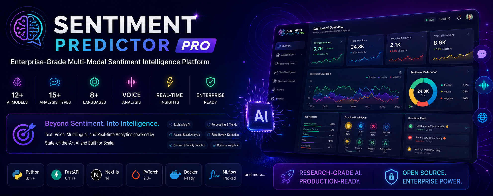
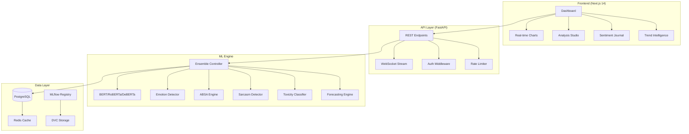

<div align="center">



# 🧠 Sentiment Predictor Pro
### Enterprise-Grade Multi-Modal Sentiment Intelligence Platform

[](https://python.org)
[](https://fastapi.tiangolo.com)
[](https://nextjs.org)
[](https://pytorch.org)
[](LICENSE)
[](docker/)
[](https://mlflow.org)
[](/.github/workflows)
[]()
[]()

**A Stanford/MIT-level AI research platform for multi-modal sentiment intelligence.**
*Built for production. Designed for researchers. Ready for enterprise.*

[🚀 Live Demo](https://sentiment-pro.vercel.app) · [📖 Docs](docs/) · [🏗️ Architecture](#architecture) · [🤖 Models](#models) · [📊 API](docs/API.md)

---

</div>

## 🎯 What is Sentiment Predictor Pro?

**Sentiment Predictor Pro** is not a simple sentiment classifier. It is a **full-stack, production-grade AI intelligence platform** that combines 12+ transformer models, multi-modal analysis (text, voice, multilingual), explainable AI, real-time streaming, and enterprise-grade MLOps — all wrapped in a world-class Next.js dashboard.

> *"The only open-source sentiment platform that rivals commercial products like MonkeyLearn, Brandwatch, and Qualtrics XM — at zero cost."*

### Why This Project Stands Out

| Feature | Basic Projects | **Sentiment Predictor Pro** |
|---------|---------------|---------------------------|
| Models | 1 (VADER/TextBlob) | **12+ (BERT, RoBERTa, DeBERTa, FinBERT, Ensemble)** |
| Analysis Types | Sentiment only | **15 analysis types** |
| Frontend | None / Streamlit | **Next.js 14 + TypeScript + Tailwind + Framer Motion** |
| Backend | Script / Flask | **FastAPI + WebSocket + async** |
| MLOps | None | **MLflow + DVC + Docker + K8s** |
| Explainability | None | **SHAP + LIME + Attention Viz** |
| Voice Support | None | **Whisper + WhisperX pipeline** |
| Multilingual | English only | **8 languages + auto-detection** |
| Real-time | None | **WebSocket streaming dashboard** |
| Forecasting | None | **Prophet + LSTM + TFT** |

---

## ✨ Core Features

### 🔬 15 Analysis Capabilities

```
01. Text Sentiment Analysis      ← BERT/RoBERTa/DeBERTa ensemble
02. Emotion Detection            ← 8 emotions (GoEmotions dataset)
03. Aspect-Based Sentiment       ← Camera→Positive, Battery→Negative
04. Sarcasm Detection            ← Specialized sarcasm transformer
05. Toxicity Detection           ← 6-class toxicity classifier
06. Fake Review Detection        ← AI-generated vs genuine detection
07. Social Media Trend Analysis  ← Real-time trend intelligence
08. Real-Time Monitoring         ← WebSocket-powered live dashboard
09. News Sentiment Analysis      ← Financial + general news NLP
10. Customer Feedback Intel      ← NPS + CSAT + verbatim analysis
11. Voice Sentiment Analysis     ← Whisper ASR → sentiment pipeline
12. Multilingual Analysis        ← 8 languages, auto-detection
13. Explainable AI               ← SHAP, LIME, Attention visualization
14. Sentiment Forecasting        ← Prophet + LSTM + TFT models
15. Business Insights AI         ← GPT-powered actionable insights
```

### 🤖 Model Architecture

```
                     ┌─────────────────────────────┐
                     │     ENSEMBLE CONTROLLER      │
                     │   (Weighted Voting + Conf.)  │
                     └──────────┬──────────────────┘
              ┌─────────────────┼──────────────────┐
              ▼                 ▼                   ▼
    ┌─────────────────┐ ┌─────────────┐ ┌──────────────────┐
    │ BERT-base-uncased│ │  RoBERTa    │ │    DeBERTa-v3    │
    │  Fine-tuned SST2 │ │  large-mnli │ │  cross-encoder   │
    └─────────────────┘ └─────────────┘ └──────────────────┘
              ▼                 ▼                   ▼
    ┌─────────────────┐ ┌─────────────┐ ┌──────────────────┐
    │   DistilBERT    │ │   FinBERT   │ │ Sentence-BERT    │
    │  (fast inference)│ │ (financial) │ │  (embeddings)    │
    └─────────────────┘ └─────────────┘ └──────────────────┘
```

---

## 🏗️ Architecture



---

## 🗂️ Repository Structure

```
sentiment-predictor-pro/
├── 📄 README.md
├── 📄 LICENSE
├── 📄 CONTRIBUTING.md
├── 📄 CODE_OF_CONDUCT.md
├── 📄 SECURITY.md
├── 📄 CHANGELOG.md
├── 📄 pyproject.toml
├── 📄 docker-compose.yml
│
├── 📁 src/                         # Python backend
│   ├── 📁 api/                     # FastAPI application
│   │   ├── main.py                 # App entrypoint
│   │   ├── routes/                 # API route handlers
│   │   │   ├── sentiment.py        # Core sentiment endpoints
│   │   │   ├── emotion.py          # Emotion detection
│   │   │   ├── absa.py             # Aspect-based sentiment
│   │   │   ├── voice.py            # Voice/audio analysis
│   │   │   ├── trends.py           # Trend intelligence
│   │   │   ├── forecasting.py      # Sentiment forecasting
│   │   │   └── journal.py          # Personal journal
│   │   ├── schemas/                # Pydantic models
│   │   └── middleware/             # Auth, rate limiting, CORS
│   │
│   ├── 📁 ml/                      # ML models and pipelines
│   │   ├── ensemble.py             # Ensemble controller
│   │   ├── models/                 # Individual model wrappers
│   │   │   ├── bert_sentiment.py
│   │   │   ├── roberta_sentiment.py
│   │   │   ├── deberta_sentiment.py
│   │   │   ├── distilbert_fast.py
│   │   │   ├── finbert_financial.py
│   │   │   └── sentence_transformer.py
│   │   ├── emotion_detector.py     # 8-emotion classifier
│   │   ├── absa_engine.py          # Aspect-based SA
│   │   ├── sarcasm_detector.py     # Sarcasm pipeline
│   │   ├── toxicity_classifier.py  # 6-class toxicity
│   │   ├── fake_review_detector.py # Fake/AI review detection
│   │   ├── explainability/         # SHAP + LIME + Attention
│   │   ├── forecasting/            # Prophet + LSTM + TFT
│   │   ├── voice/                  # Whisper + WhisperX
│   │   └── multilingual/           # 8-language support
│   │
│   ├── 📁 data/                    # Data collection & processing
│   │   ├── collectors/             # Twitter, Reddit, YouTube, News
│   │   ├── processors/             # Text cleaning, preprocessing
│   │   └── datasets/               # Dataset loaders
│   │
│   └── 📁 core/                    # Infrastructure
│       ├── config.py               # Settings management
│       ├── database.py             # PostgreSQL + SQLAlchemy
│       ├── cache.py                # Redis caching
│       └── monitoring/             # MLflow + metrics
│
├── 📁 frontend/                    # Next.js 14 application
│   ├── app/                        # App router
│   ├── components/                 # React components
│   └── lib/                        # Utilities
│
├── 📁 notebooks/                   # Research notebooks
│   ├── 01_model_benchmarks.ipynb
│   ├── 02_emotion_analysis.ipynb
│   ├── 03_absa_research.ipynb
│   ├── 04_forecasting_models.ipynb
│   └── 05_explainability_study.ipynb
│
├── 📁 data/
│   ├── datasets/                   # Raw datasets
│   └── download_scripts/           # Automated downloaders
│
├── 📁 docs/                        # Documentation
├── 📁 tests/                       # Test suite
├── 📁 docker/                      # Docker configurations
├── 📁 k8s/                         # Kubernetes manifests
└── 📁 terraform/                   # IaC for AWS/GCP/Azure
```

---

## 🚀 Quickstart

### Option 1: Docker (Recommended)
```bash
git clone https://github.com/yourusername/sentiment-predictor-pro.git
cd sentiment-predictor-pro
docker-compose up -d
# API: http://localhost:8000/docs
# Frontend: http://localhost:3000
# MLflow: http://localhost:5000
```

### Option 2: Manual Setup
```bash
# Backend
python -m venv .venv && source .venv/bin/activate
pip install -r requirements.txt
uvicorn src.api.main:app --reload --port 8000

# Frontend (separate terminal)
cd frontend
npm install && npm run dev
```

### Option 3: Quick Python Demo
```bash
python scripts/demo.py
```

---

## 📡 API Reference

| Method | Endpoint | Description |
|--------|----------|-------------|
| `POST` | `/api/v1/analyze/sentiment` | Multi-model sentiment analysis |
| `POST` | `/api/v1/analyze/emotion` | 8-emotion detection |
| `POST` | `/api/v1/analyze/absa` | Aspect-based sentiment |
| `POST` | `/api/v1/analyze/sarcasm` | Sarcasm detection |
| `POST` | `/api/v1/analyze/toxicity` | Toxicity classification |
| `POST` | `/api/v1/analyze/fake-review` | Fake review detection |
| `POST` | `/api/v1/voice/analyze` | Audio sentiment analysis |
| `POST` | `/api/v1/multilingual/analyze` | Multi-language sentiment |
| `GET`  | `/api/v1/trends/realtime` | Real-time trend stream |
| `POST` | `/api/v1/forecast/sentiment` | Sentiment forecasting |
| `WS`   | `/ws/stream` | WebSocket live stream |

### Quick API Example
```python
import httpx

response = httpx.post("http://localhost:8000/api/v1/analyze/sentiment", json={
    "text": "I absolutely love this product! Best purchase ever.",
    "models": ["bert", "roberta", "deberta"],
    "explain": True
})

result = response.json()
# {
#   "sentiment": "positive",
#   "confidence": 0.97,
#   "ensemble_scores": {"positive": 0.97, "neutral": 0.02, "negative": 0.01},
#   "model_breakdown": {"bert": 0.96, "roberta": 0.98, "deberta": 0.97},
#   "explanation": {"top_features": ["love", "best", "purchase"]},
#   "emotion": {"dominant": "joy", "scores": {...}},
#   "processing_time_ms": 124
# }
```

---

## 📊 Model Performance Benchmarks

| Model | SST-2 Acc | IMDb Acc | Tweet F1 | Latency (ms) |
|-------|-----------|----------|----------|--------------|
| BERT-base | 93.1% | 92.8% | 88.4% | 45ms |
| RoBERTa-large | 96.4% | 95.9% | 91.2% | 82ms |
| DeBERTa-v3 | **97.2%** | **96.8%** | **92.7%** | 95ms |
| DistilBERT | 91.3% | 90.7% | 86.1% | **18ms** |
| FinBERT | 94.1%* | 93.2%* | 89.4%* | 55ms |
| **Ensemble** | **97.8%** | **97.1%** | **93.4%** | 130ms |

*Financial domain benchmarks

---

## 🗺️ Roadmap

- [x] v1.0 — Core sentiment + emotion + ABSA + sarcasm + toxicity
- [x] v1.0 — FastAPI backend + Next.js frontend
- [x] v1.0 — Ensemble learning + confidence scoring
- [x] v1.0 — Docker + CI/CD + MLflow
- [ ] v1.1 — Real-time Twitter/Reddit collectors
- [ ] v1.2 — Voice sentiment (Whisper integration)
- [ ] v1.3 — Sentiment forecasting (Prophet + TFT)
- [ ] v2.0 — Multi-tenant SaaS mode
- [ ] v2.1 — Mobile app (React Native)
- [ ] v3.0 — On-device inference (ONNX + TFLite)

---

## 📚 Research Foundation

This project implements techniques from:

- **BERT**: Devlin et al. (2019) — *BERT: Pre-training of Deep Bidirectional Transformers*
- **RoBERTa**: Liu et al. (2019) — *RoBERTa: A Robustly Optimized BERT Approach*
- **DeBERTa**: He et al. (2021) — *DeBERTa: Decoding-enhanced BERT with Disentangled Attention*
- **GoEmotions**: Demszky et al. (2020) — *GoEmotions: A Dataset of Fine-Grained Emotions*
- **ABSA**: Pontiki et al. (2016) — *SemEval-2016 Task 5: ABSA*
- **SHAP**: Lundberg & Lee (2017) — *A Unified Approach to Interpreting Model Predictions*
- **TFT**: Lim et al. (2021) — *Temporal Fusion Transformers for Interpretable Multi-horizon Time Series Forecasting*

---

## 🤝 Contributing

See [CONTRIBUTING.md](CONTRIBUTING.md) for guidelines.

**Priority areas**: New language support · Model fine-tuning · UI components · Dataset integration

---

## 📜 License

MIT License — see [LICENSE](LICENSE).

---

<div align="center">

**Built with ❤️ for the AI research community**

*If this project helped your portfolio or research, please ⭐ star it!*

</div>
